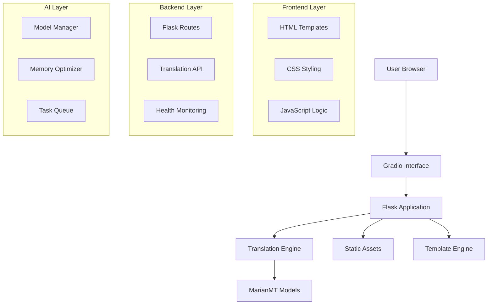
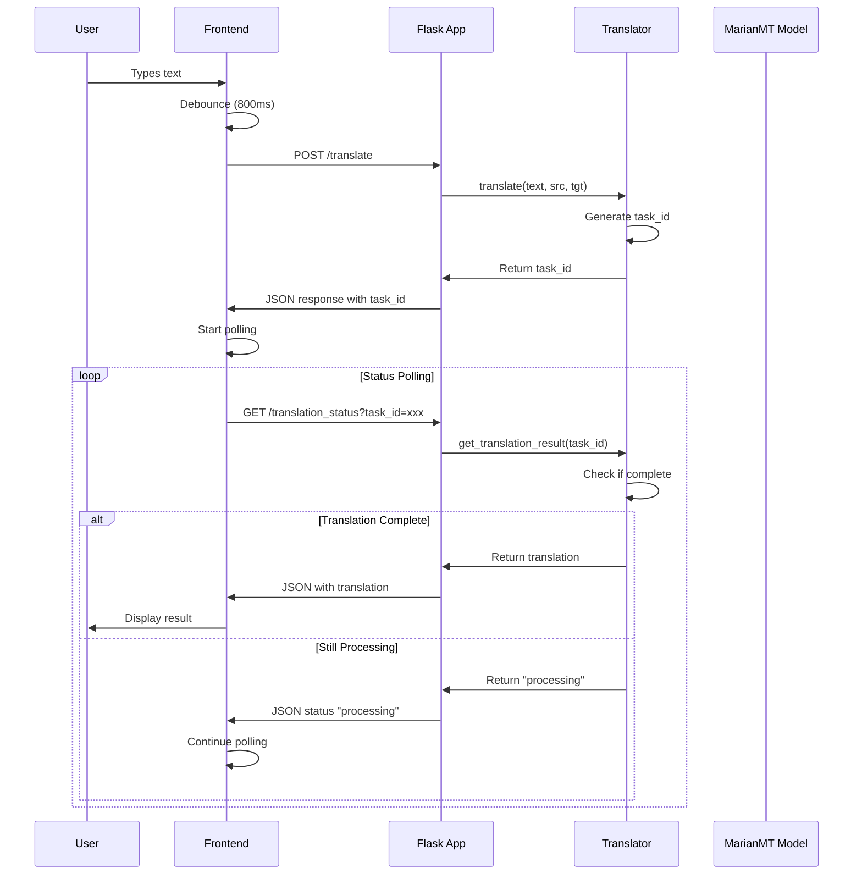
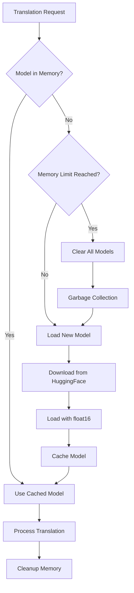

# 🏗️ LinguaSync Architecture Documentation

## 📊 System Overview

LinguaSync is a modern, cloud-native multilingual translation application built with a microservices-inspired architecture optimized for Hugging Face Spaces deployment.



## 🔧 Component Architecture

### 1. Entry Point Layer

#### **app.py** - Gradio Wrapper
```python
# Purpose: Hugging Face Spaces compatibility
# Function: Wraps Flask app in Gradio interface
# Key Features:
- Threading for Flask background execution
- Iframe embedding for seamless integration
- Gradio Blocks interface for HF Spaces
```

**Responsibilities:**
- Initialize Flask app in background thread
- Create Gradio interface for HF Spaces
- Handle port management (5000 for Flask, 7860 for Gradio)
- Provide seamless user experience

#### **main.py** - Alternative Entry Point
```python
# Purpose: Direct Flask execution for local development
# Function: Simplified Flask runner
# Key Features:
- Direct Flask app execution
- Environment detection
- Memory optimization settings
```

### 2. Web Application Layer

#### **translator/app.py** - Flask Application Core
```python
# Architecture Pattern: MVC (Model-View-Controller)
# Design Pattern: Lazy Loading, Singleton (for translator instance)
```

**Key Components:**

**Route Handlers:**
- `GET /` - Main interface (renders index.html)
- `POST /translate` - Translation API endpoint
- `GET /translation_status` - Async status checking
- `GET /health` - Health monitoring

**Configuration Management:**
- Environment detection (HF Spaces vs local)
- Lazy translator initialization
- Static file serving configuration

**Error Handling:**
- Graceful degradation for missing translations
- Comprehensive error logging
- User-friendly error messages

### 3. Translation Engine Layer

#### **translator/translator.py** - Core Translation Logic

**Architecture Pattern:** Producer-Consumer with Thread Pool

```python
class Translator:
    # Design Patterns Used:
    # - Singleton (single instance per app)
    # - Factory (model creation)
    # - Observer (task status tracking)
    # - Strategy (different translation strategies)
```

**Key Components:**

**Model Management:**
```python
self.models = {
    'en-fr': 'Helsinki-NLP/opus-mt-en-fr',
    'en-es': 'Helsinki-NLP/opus-mt-en-es',
    # ... 8 total language pairs
}
```

**Memory Optimization:**
```python
self.max_models_in_memory = 1  # Critical for cloud deployment
# Automatic garbage collection
# Half-precision (float16) loading
# Dynamic model unloading
```

**Asynchronous Processing:**
```python
# Background worker thread
# Task queue for translation requests
# UUID-based task tracking
# Non-blocking API responses
```

### 4. Frontend Architecture

#### **templates/base.html** - Layout Foundation
```html
<!-- Architecture: Component-based layout -->
<!-- Patterns: Template inheritance, Progressive enhancement -->
```

**Key Features:**
- Responsive grid system (Bootstrap 5)
- Component-based sidebar
- Mobile-first design
- Accessibility compliance (ARIA labels)

**CSS Architecture:**
```css
/* CSS Custom Properties for theming */
:root {
    --primary-color: #6366f1;
    --secondary-color: #8b5cf6;
    /* ... consistent design tokens */
}
```

#### **templates/index.html** - Main Interface
```html
<!-- Architecture: Single Page Application (SPA) behavior -->
<!-- Patterns: Event-driven programming, AJAX communication -->
```

**JavaScript Architecture:**
```javascript
// Module Pattern for organization
// Event-driven architecture
// Async/await for API calls
// Local storage for persistence
```

**Key Features:**
- Real-time translation (debounced input)
- Progress tracking with visual feedback
- History management with local storage
- Toast notification system
- Responsive animations

## 🔄 Data Flow Architecture

### Translation Request Flow



### Model Loading Flow



## 🧠 Memory Management Architecture

### Strategy: Aggressive Memory Optimization

**Problem:** Cloud environments have limited memory (16GB on HF Spaces)
**Solution:** Multi-layered memory management

#### Layer 1: Model Limitation
```python
self.max_models_in_memory = 1
# Only one MarianMT model loaded at any time
# Automatic eviction when new model needed
```

#### Layer 2: Precision Optimization
```python
torch_dtype=torch.float16  # Half-precision
low_cpu_mem_usage=True     # Efficient loading
```

#### Layer 3: Garbage Collection
```python
import gc
gc.collect()                    # Force cleanup
torch.cuda.empty_cache()       # Clear GPU cache (if available)
```

#### Layer 4: Text Chunking
```python
max_length = 512  # Token limit per chunk
# Automatic text splitting for long inputs
# Prevents memory overflow on large texts
```

## 🔒 Security Architecture

### Input Validation
```python
# Text sanitization
# Length limits (prevent DoS)
# Language code validation
# Task ID validation (UUID format)
```

### Error Handling
```python
# No sensitive information in error messages
# Graceful degradation
# Comprehensive logging for debugging
```

### Resource Protection
```python
# Memory limits prevent resource exhaustion
# Request rate limiting through natural processing delays
# Automatic cleanup prevents memory leaks
```

## 📊 Performance Architecture

### Optimization Strategies

#### 1. Lazy Loading
- Translator instance created on first request
- Models loaded only when needed
- Templates cached by Flask

#### 2. Asynchronous Processing
- Non-blocking translation requests
- Background worker thread
- Task-based status tracking

#### 3. Client-Side Optimization
- Debounced input (800ms delay)
- Local storage for history
- Efficient DOM manipulation

#### 4. Caching Strategy
```python
# Model caching (memory permitting)
# Template caching (Flask built-in)
# Static asset caching (browser)
```

### Performance Metrics

**Target Performance:**
- First load: <60 seconds (model download)
- Subsequent translations: <5 seconds
- Memory usage: <2GB peak
- UI responsiveness: <100ms

## 🌐 Deployment Architecture

### Hugging Face Spaces Integration

```yaml
# Space Configuration
sdk: gradio              # Required for HF Spaces
app_file: app.py        # Entry point
python_version: 3.10.11 # Specified in runtime.txt
```

### Container Architecture
```dockerfile
# Implicit Dockerfile (managed by HF Spaces)
FROM python:3.10.11
COPY requirements.txt .
RUN pip install -r requirements.txt
COPY . .
EXPOSE 7860
CMD ["python", "app.py"]
```

### Environment Detection
```python
is_hf_spaces = os.environ.get('SPACE_ID') is not None
# Automatic environment adaptation
# Different configurations for local vs cloud
```

## 🔄 Scalability Architecture

### Horizontal Scaling Considerations
- **Stateless Design**: No server-side session storage
- **Model Sharing**: Could implement Redis for model caching
- **Load Balancing**: Multiple Space instances possible

### Vertical Scaling Options
- **CPU Upgrade**: 8 vCPU, 32GB RAM ($9/month)
- **GPU Acceleration**: Not needed for MarianMT models
- **Memory Optimization**: Already implemented

## 🧪 Testing Architecture

### Component Testing Strategy
```python
# Unit Tests: Individual functions
# Integration Tests: API endpoints
# End-to-End Tests: Full user workflows
# Performance Tests: Memory and speed
```

### Monitoring Architecture
```python
# Health check endpoint (/health)
# Error logging and tracking
# Performance metrics collection
# User analytics (HF Spaces built-in)
```

## 🔮 Future Architecture Considerations

### Potential Enhancements
1. **Microservices Split**: Separate translation service
2. **Database Integration**: PostgreSQL for persistent history
3. **Caching Layer**: Redis for model and translation caching
4. **API Gateway**: Rate limiting and authentication
5. **Container Orchestration**: Kubernetes for enterprise deployment

### Technology Evolution
- **Model Updates**: Newer MarianMT versions
- **Framework Updates**: Flask 3.0, Bootstrap 6
- **AI Integration**: GPT-based translation models
- **Real-time Features**: WebSocket for live translation

---

This architecture provides a solid foundation for a production-ready translation service while maintaining simplicity and cost-effectiveness for deployment on Hugging Face Spaces.